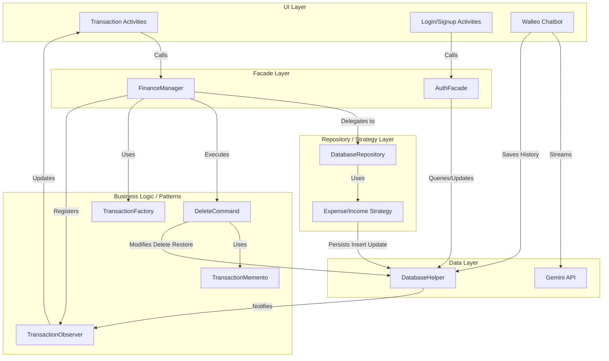
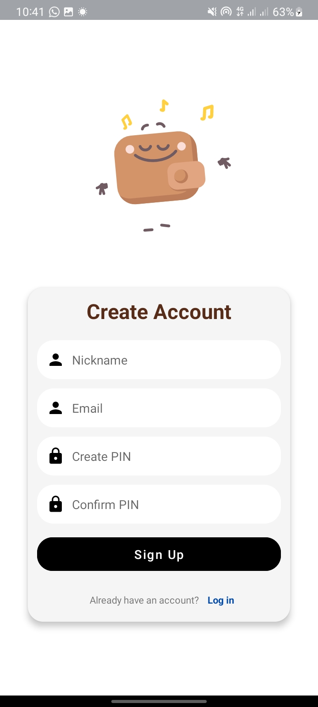
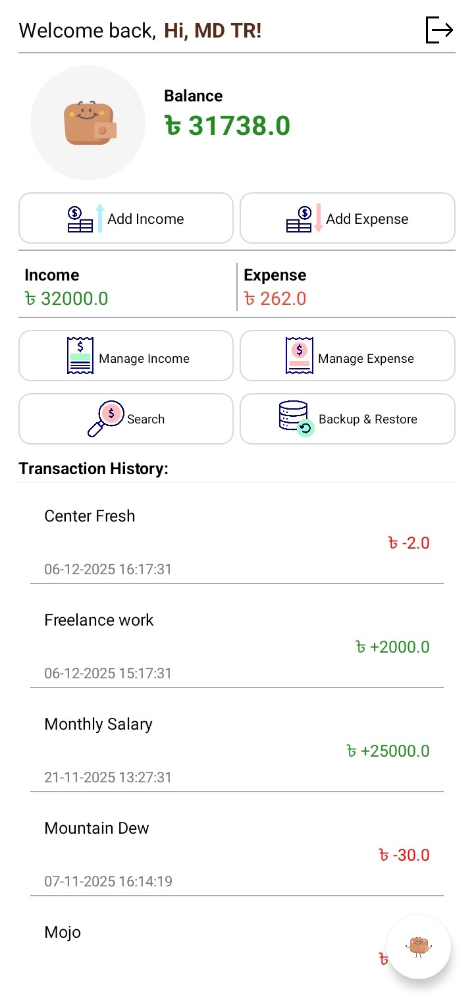
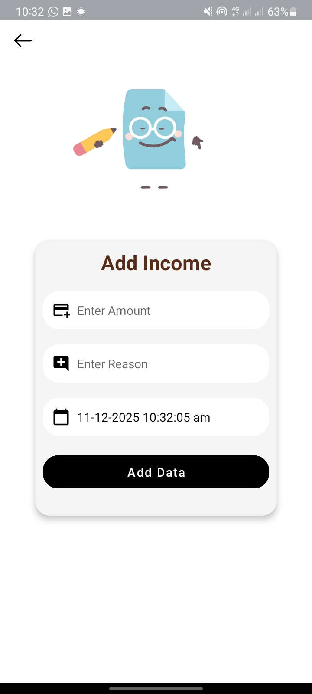
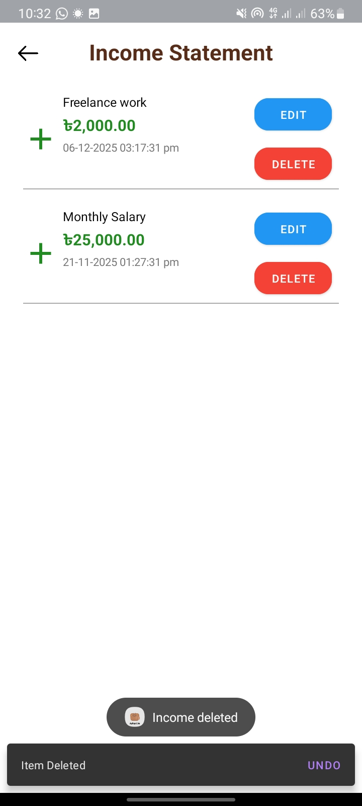
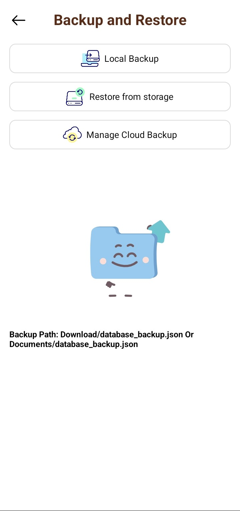
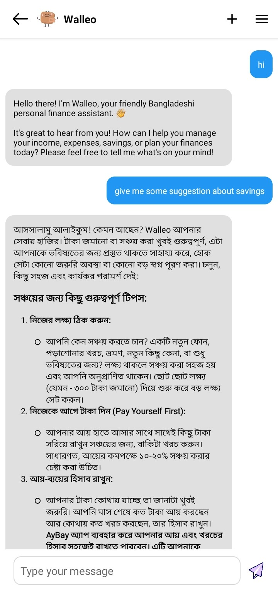

  

<h1 align="center">AyBay</h1>

<i>
A powerful and lightweight Android application for tracking income, expenses, budgets, savings, loans, and more.
</i>

---

## Features

- **Comprehensive Tracking**: Track income, expenses, savings, budgets, and loans/debts.
- **Smart AI Assistant**: "Walleo" - Built-in AI chatbot for personalized financial guidance and suggestions.
- **Data Visualization**: View clean statistics to understand your financial health.
- **Search & Filter**: Easily find transactions by date, type, or specific queries.
- **Backup & Restore**: Secure cloud backup via Google Drive and local storage options.
- **Offline First**: Fully functional offline with robust SQLite local storage.
- **Modern UI**: Clean, fast, and responsive user interface.

---

## Installation

You can install AyBay from:

---

## Architecture & Design Patterns

AyBay is built using a **Pattern-Oriented MVC Architecture**, leveraging standard GoF design patterns to ensure scalability, maintainability, and clean code.

### Data Flow Diagram

### Implemented Patterns:

- **Facade Pattern**: `FinanceManager` acts as a unified interface to the complex subsystem of data repositories and logic.
- **Strategy Pattern**: `DataOperationStrategy` interfaces with concrete implementations like `ExpenseOperationStrategy` and `IncomeOperationStrategy` to handle different transaction types dynamically.
- **Observer Pattern**: `TransactionObserver` allows the UI (`ShowExpense`, `ShowIncome`) to react automatically to data changes in the repository.
- **Command Pattern**: `DeleteCommand` encapsulates delete requests, enabling features like Undo operations.
- **Composite Pattern**: `CategoryComposite` treats individual transactions and groups of categories uniformly for calculating totals.
- **Iterator Pattern**: `TransactionIterator` provides a standard way to traverse collections of transactions without exposing underlying representations.
- **Factory Pattern**: `TransactionFactory` handles the creation of complex `Transaction` objects.
- **Adapter Pattern**: `CurrencyAdapter` and `DateAdapter` transform data formats to be compatible with UI requirements.
- **Memento Pattern**: Support for capturing and restoring object state (e.g., for Undo functionality).
- **Singleton Pattern**: Ensures crucial classes like `FinanceManager` and `DatabaseHelper` have a single shared instance.

### Data Flow Diagram

---

## Built With

- **Language**: Java (Android SDK)
- **Database**: SQLite (Custom `DatabaseHelper`)
- **Testing**: JUnit 5, Mockito
- **Networking**: OkHttp (for AI Chatbot)

---

## Screenshots

   &nbsp;
   &nbsp;
  

   &nbsp;
   &nbsp;
  

   &nbsp;
   &nbsp;
  

---

## ⚠️ Disclaimer

This app is for educational and personal finance management purposes only.  
It is not associated with any banking or financial institution.
